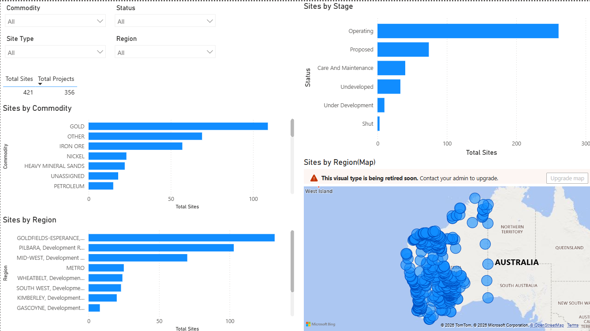
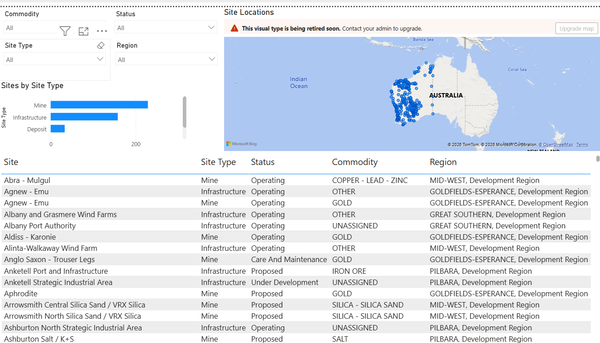

# WA Mining Portfolio — Data Pipeline & Full-Stack Application

[](https://github.com/tonynguyen1292/WA_Mining/actions/workflows/ci.yml)

A PostgreSQL-backed system for Western Australia's public Major Resources Projects dataset (MINEDEX): a SQL data pipeline that cleans and models the raw government export, and a FastAPI + React application built on top of it for exploring the portfolio interactively. A Power BI dashboard remains available as an alternative reporting surface on the same data.

## Project Overview

This project takes a raw government export of WA mining, infrastructure, and petroleum sites and turns it into an analysis-ready data model, then exposes it two ways:

- **The app** (`backend/` + `frontend/`) — a live, filterable dashboard and sites explorer. This is the primary, actively developed interface. See [Getting Started](#getting-started).
- **The original SQL pipeline + Power BI** (`SQL/`, `POWER_BI/`) — the pipeline that established the cleaning rules the app now reuses, and a static dashboard on the same rules. Kept as reference/lineage documentation. See [System / Workflow Summary](#system--workflow-summary).

The CSV snapshot currently included in this repo (`DATABASES/raw/Major_Resource_Projects.csv`) contains 421 site records across 356 distinct projects.

## Problem Statement

The source dataset is a flat CSV with data-quality issues typical of a raw government export: inconsistent region/LGA labels (suffixes like ", SHIRE OF"), two overlapping status encodings (`STAGE` and `SYMBOL_STATUS`), and a site-vs-project grain mismatch — a single project can have multiple sites (mine, processing plant, port), so naive counting double-counts projects. Before any reporting is possible, the data has to be cleaned and modeled with an explicit grain decision. That's what the SQL layer in this repo does.

## Getting Started

The project is evolving from a SQL + Power BI analytics project into a runnable full-stack application (FastAPI + PostgreSQL + React). **Phases 1–3 are implemented: backend foundation, database + seed pipeline, and the React frontend.** Component-level detail lives in [backend/README.md](backend/README.md) and [frontend/README.md](frontend/README.md); this section is the fastest path to a running app.

### Prerequisites

- [Docker Desktop](https://www.docker.com/products/docker-desktop/) (running, not just installed) — or a local PostgreSQL install if you'd rather skip Docker (see Step 2's native option)
- [Node.js](https://nodejs.org/) 18+ and npm, for the frontend

### Step 1 — Clone and enter the repo

```
git clone https://github.com/tonynguyen1292/WA_Mining
cd WA_Mining
```

### Step 2 — Start PostgreSQL + the backend API

```
docker compose up --build
```

This builds the FastAPI image and starts two containers: `db` (Postgres 16) and `backend` (the API, with hot reload). First run pulls the base images, so it can take a minute or two.

<details>
<summary>Prefer no Docker? Native backend setup</summary>

```
createdb wa_mining
cd backend
python -m venv .venv && .venv\Scripts\activate   # or source .venv/bin/activate on macOS/Linux
pip install -r requirements.txt
cp .env.example .env   # edit DATABASE_URL if your local Postgres differs
uvicorn app.main:app --reload
```
Run the seed command in Step 3 with plain `python -m app.db.seed` instead of the `docker compose exec` form.
</details>

### Step 3 — Seed the database

In a second terminal, with the stack from Step 2 still running:

```
docker compose exec backend python -m app.db.seed
```

This loads `DATABASES/raw/Major_Resource_Projects.csv`, applies the same cleaning rules as `SQL/01`–`03` (ported to `backend/app/db/seed.py`), and populates the `sites` table. It's safe to re-run — it clears and reloads `sites` each time. You should see `Seeded 421 sites from Major_Resource_Projects.csv`.

### Step 4 — Verify the backend

Open http://localhost:8000/docs — you should see the interactive Swagger UI listing `health`, `sites`, `kpis`, and `meta` endpoints. Try `GET /api/kpis` and confirm `total_sites` is `421`.

### Step 5 — Start the frontend

In a third terminal:

```
cd frontend
npm install
cp .env.example .env   # VITE_API_BASE_URL defaults to http://localhost:8000, matching Step 2
npm run dev
```

### Step 6 — Verify the app

Open http://localhost:5173 — the Dashboard should load with KPI cards (421 total sites, 356 total projects) and three breakdown charts (stage/commodity/region). From there:
- **Sites** in the nav bar → a filterable, paginated table of all 421 sites
- Click any site → its full detail page

### Troubleshooting

| Symptom | Likely cause |
|---|---|
| `docker compose up` fails to connect / hangs | Docker Desktop isn't running — start it and wait for "Engine running" before retrying |
| Backend starts but `/api/sites` returns an empty list | Seed step (Step 3) hasn't been run yet, or hasn't finished |
| Frontend loads but shows no data / network errors in console | Backend isn't running, or `frontend/.env`'s `VITE_API_BASE_URL` doesn't match where the API is actually listening |
| `docker compose exec backend python -m app.db.seed` can't find the CSV | You're not running it from the repo root, or `DATABASES/raw/Major_Resource_Projects.csv` isn't present — see `DATABASES/README_database.md` |

### Key endpoints

| Endpoint | Purpose |
|---|---|
| `GET /health` | Liveness check |
| `GET /api/sites` | Paginated site list; filter with `commodity`, `region`, `stage`, `site_type`, `search` |
| `GET /api/sites/{site_code}` | Single site detail |
| `GET /api/kpis` | Portfolio KPIs (totals + breakdowns by stage/type/commodity/region), same filters as above |
| `GET /api/meta/filters` | Distinct filter values, for populating dropdowns |

## Production / Deployment

`docker-compose.yml` (used above) is for local development: it bind-mounts `backend/` for hot reload and runs `uvicorn --reload`. For a production-like build — no source mounts, no reload, the frontend built and served as static assets through nginx — use `docker-compose.prod.yml` instead:

```
docker compose -f docker-compose.prod.yml up --build
docker compose -f docker-compose.prod.yml exec backend python -m app.db.seed
```

- Frontend (nginx, static build): http://localhost:8080
- Backend API: http://localhost:8000

Differences from the dev compose file: the backend runs without `--reload`; the frontend is a multi-stage build (`frontend/Dockerfile`) — `npm run build` in a `node` stage, then served by `nginx` (`frontend/nginx.conf` handles the SPA fallback so client-side routes like `/sites/S0001538` don't 404 on a hard refresh); and Postgres isn't exposed to the host. This is still a single-host Compose setup, not a cloud deployment — see Future Improvements for what's not covered (managed DB, secrets, TLS, horizontal scaling).

### CI

`.github/workflows/ci.yml` runs on every push/PR to `main`: backend lint (`ruff`) + compile check, and frontend typecheck + build (`tsc -b && vite build`). Both must pass before merging.

## System / Workflow Summary

This is the original SQL pipeline. It's kept as the documented, reusable source of truth for the cleaning rules — `backend/app/db/seed.py` ports this same logic (TRIM / INITCAP / region+LGA suffix handling) directly into the application's seed step, so the two stay conceptually in sync. Power BI remains a valid alternative reporting surface on the same database.

```
Major_Resource_Projects.csv (DATABASES/raw/)
        │
        ▼
SQL/01_create_raw_table.sql    →  staging_sites (raw load, all columns as TEXT)
        │
        ▼
SQL/02_create_clean_table.sql  →  sites (typed, cleaned schema)
SQL/03_insert_cleaned_data.sql →  cleaning + standardization applied on insert
        │
        ▼
SQL/04_create_summary_view.sql →  views: sites_by_commodity, sites_by_stage,
                                    sites_by_region, sites_by_type
SQL/05_portfolio_summary.sql   →  portfolio_summary rollup table
        │
        ▼
Power BI (POWER_BI/wa_mining_dashboard_v2.pbix)
```

`SQL/run_all.sql` runs the full sequence above in one pass — see *Setup / How to Run (legacy SQL + Power BI)* below.

The PostgreSQL database (`wa_mining`) is the source of truth for the analytical model; Power BI connects to it and replicates part of the `portfolio_summary` logic in DAX for interactive slicing (see *Key Engineering Decisions*).

## Tech Stack

- **PostgreSQL** — system of record, both for the original SQL pipeline and the FastAPI app's `sites` table
- **FastAPI + SQLAlchemy** — read-only API over the cleaned portfolio data (`backend/`)
- **React + TypeScript + Vite** — dashboard, sites explorer, and site detail pages (`frontend/`)
- **Recharts** — portfolio breakdown charts
- **Docker Compose** — local dev (`docker-compose.yml`) and a production-like build (`docker-compose.prod.yml`, nginx-served frontend)
- **GitHub Actions** — CI: backend lint/compile, frontend typecheck/build
- **Power BI + DAX** — dashboard and interactive reporting (legacy/reference reporting surface)
- **Git / GitHub** — version control and documentation
- **Notion** — supplementary planning docs and task tracking from early project stages (see *Further Reading*; not part of the technical pipeline)

## Repository Structure

```
WA_Mining/
├── README.md
├── data_dictionary.md
├── .gitignore
├── docker-compose.yml                 # Postgres + backend, local dev (hot reload)
├── docker-compose.prod.yml            # full stack, production-like build (nginx frontend)
├── .github/workflows/ci.yml           # backend lint/compile + frontend typecheck/build
├── image.png                          # legacy screenshot, superseded by POWER_BI/screenshots/ (pending cleanup)
├── image-1.png                        # legacy screenshot, superseded by POWER_BI/screenshots/ (pending cleanup)
├── backend/                           # FastAPI app (Phase 1-2: API + DB seed pipeline)
│   ├── app/
│   │   ├── main.py                    # app entrypoint, router registration
│   │   ├── core/                      # config, DB engine/session
│   │   ├── models/                    # SQLAlchemy models (Site)
│   │   ├── schemas/                   # Pydantic request/response types
│   │   ├── api/routes/                # health, sites, kpis, meta endpoints
│   │   ├── services/                  # query logic (filters, KPI aggregation)
│   │   └── db/seed.py                 # loads + cleans the CSV into `sites`
│   ├── requirements.txt
│   ├── requirements-dev.txt           # + ruff, for CI/local linting
│   ├── Dockerfile
│   ├── .dockerignore
│   ├── .env.example
│   └── README.md                      # backend-specific setup, structure, endpoints
├── frontend/                          # React + TypeScript app (Phase 3)
│   ├── src/
│   │   ├── main.tsx, App.tsx          # entrypoint, routing, nav
│   │   ├── api/client.ts              # typed fetch wrapper over the backend API
│   │   ├── pages/                     # DashboardPage, SitesPage, SiteDetailPage
│   │   ├── components/                # FilterBar, KpiCard, SitesTable, charts/
│   │   ├── hooks/useDebouncedValue.ts
│   │   └── types/site.ts
│   ├── package.json
│   ├── Dockerfile                     # multi-stage: build (node) -> serve (nginx)
│   ├── nginx.conf                     # SPA fallback for client-side routing
│   ├── .dockerignore
│   ├── .env.example
│   └── README.md                      # frontend-specific setup, structure, scripts
├── DATABASES/
│   ├── README_database.md             # explains where to download the CSV from
│   └── raw/
│       └── Major_Resource_Projects.csv
├── DOCUMENTS/
│   ├── Licence_CCBY4.pdf
│   └── METADATA/
│       ├── MINEDEX_Major_Resource_Projects_Map_DataDictionary_GDA2020.pdf
│       └── MINEDEX_Major_Resource_Projects_Map_Metadata_GDA2020.pdf
├── SQL/                                # legacy/reference pipeline — logic ported into backend/app/db/seed.py
│   ├── 01_create_raw_table.sql
│   ├── 02_create_clean_table.sql
│   ├── 03_insert_cleaned_data.sql
│   ├── 04_create_summary_view.sql
│   ├── 05_portfolio_summary.sql
│   └── run_all.sql
└── POWER_BI/                           # legacy/reference reporting surface
    ├── wa_mining_dashboard_v1.pbix     # superseded by v2, kept for now (see Future Improvements)
    ├── wa_mining_dashboard_v2.pbix     # current version
    └── screenshots/
        ├── dashboard_overview.png
        └── dashboard_regional_analysis.png
```

## Setup / How to Run (legacy SQL + Power BI)

This runs the original pipeline standalone, without the app — useful if you only want the Power BI dashboard, or want to inspect the SQL directly. For the app, see [Getting Started](#getting-started) above.

1. Install PostgreSQL locally.
2. Create the database and run the full pipeline:
   ```
   createdb wa_mining
   psql -d wa_mining -f SQL/run_all.sql
   ```
   This runs `01`→`05` in order and loads `DATABASES/raw/Major_Resource_Projects.csv` into `staging_sites` along the way. Run it from the repository root so the relative paths resolve.
3. Open `POWER_BI/wa_mining_dashboard_v2.pbix` in Power BI Desktop and refresh the data connection.

`DATABASES/README_database.md` currently documents this CSV as something to download fresh from the DMIRS Data and Software Centre rather than store in the repo — in practice a snapshot is committed under `DATABASES/raw/` today. This is a known inconsistency, not yet resolved (see *Future Improvements*).

## Key Engineering Decisions

- **Grain:** modeled at site level, not project level, to preserve operational asset detail — multiple sites can map to a single project code (`PROJ_CODE`); this repo's snapshot has 421 sites across 356 projects.
- **Schema:** a single flat, typed table (`sites`) rather than a star schema — the snapshot data doesn't have update/history requirements that would justify one.
- **Commodity dimension:** `TARGET_GROUP_NAME` is used as the primary commodity field instead of the raw `COMMODITIES` column, which stores pipe-delimited multi-value lists that aren't directly groupable.
- **Status field:** `STAGE` is used as the primary status dimension; `SYMBOL_STATUS` (a second, overlapping status encoding in the source data) is kept only for cross-checking, not as a reporting field.
- **String cleaning:** region and LGA names are standardized in SQL (`TRIM`, `INITCAP`, and `CASE`-based suffix handling in `03_insert_cleaned_data.sql`) rather than in Power Query, so the cleaning logic lives with the data model and is re-runnable independent of the BI tool.
- **DAX/SQL parity:** the Power BI measures replicate the `portfolio_summary` SQL logic (COUNT/CASE patterns) rather than reimplementing separate business logic in DAX from scratch.

## Challenges and Trade-offs

| Challenge | Approach taken |
|---|---|
| Mixed asset types (mine, infrastructure, deposit, other) in one source table | Segmented using `TARGET_GROUP_NAME` and `SITE_TYPE`, documented in `data_dictionary.md` |
| Multi-commodity fields with pipe-delimited lists | Used the cleaned `TARGET_GROUP_NAME` single-value field instead of parsing `COMMODITIES` |
| Region/LGA names with inconsistent suffixes (e.g. ", SHIRE OF") | Handled in SQL with `CASE`-based text transforms during the clean-table insert |
| Site-to-project duplicate counting | Exposed both project-level and site-level counts as separate measures in Power BI, rather than picking one and hiding the ambiguity |
| No capital-cost field in the source dataset | Out of scope for this version — noted explicitly in `data_dictionary.md` rather than estimated or backfilled |
| `05_portfolio_summary.sql` only buckets 4 of the 6 real `STAGE` values (`Operating`, `Proposed`, `Care and Maintenance`, `Under Development`) | Known gap — `Undeveloped` (33 sites) and `Shut` (3 sites) currently fall outside the per-stage breakdown, though they're still included in `total_sites`. Not fixed in this pass; tracked in Future Improvements |

## Screenshots

**Overview page** — portfolio-wide snapshot (commodity, stage, region breakdowns):



**Regional and Operational View** — drill-down by region, project, and site type:



`wa_mining_dashboard_v2.pbix` is the current version — it corrects region/LGA name suffixes that `v1` still has.

## Business Context

The dataset is sourced from DMIRS's MINEDEX Major Resource Projects export and covers WA's mining, mineral processing, and petroleum sites. In the CSV snapshot currently in this repo: 229 Mine sites, 158 Infrastructure sites, 33 Deposit sites, and 1 Other site, across 356 distinct projects. By stage: 261 Operating, 74 Proposed, 40 Care and Maintenance, 33 Undeveloped, 10 Under Development, and 3 Shut. Projects cluster regionally (e.g. iron ore concentrated in the Pilbara, gold in the Goldfields), which is one of the drill-downs the dashboard supports.

## Data Source

- DMIRS Data and Software Centre – [MINEDEX Major Resource Projects](https://dasc.dmirs.wa.gov.au/home?productAlias=MINEDEXMajorResProj) (see `DATABASES/README_database.md` for download steps)
- WA Government – [Western Australia's Principal Resource Projects](https://www.wa.gov.au/organisation/department-of-mines-petroleum-and-exploration/western-australias-principal-resource-projects)
- Licence: `DOCUMENTS/Licence_CCBY4.pdf` (CC BY 4.0)
- Metadata: `DOCUMENTS/METADATA/`
- Field-level documentation: [`data_dictionary.md`](./data_dictionary.md)

## Future Improvements

- Not yet covered by `docker-compose.prod.yml`: managed/cloud database, secrets management, TLS, horizontal scaling, and CD (CI currently only lints/builds — it doesn't deploy anywhere).
- Filter state and pagination aren't synced to the URL, so filtered/paginated links aren't shareable.
- No automated tests yet (backend or frontend) — CI currently catches lint/type/compile errors, not behavioral regressions.
- `backend/app/models/site.py` adds `title` and `short_title` to the original `SQL/02` clean-table schema (present in the raw CSV/`staging_sites` but previously dropped) — needed as the human-readable site name for any UI.
- Reconcile `DATABASES/README_database.md` (says the CSV isn't stored in the repo) with the fact that a snapshot currently is — either remove the tracked CSV (`.gitignore` now correctly excludes future changes to it) or update the doc to reflect that a snapshot is intentionally kept.
- The `STAGE` bucketing gap is fixed in the app (`GET /api/kpis` groups dynamically, so `Undeveloped` and `Shut` are included) but `SQL/05_portfolio_summary.sql` itself still only buckets 4 of 6 stages — left as-is since that file is kept for reference/lineage, not actively used by the app.
- Decide whether to keep `POWER_BI/wa_mining_dashboard_v1.pbix` (superseded by v2) or remove it.
- Remove or repurpose the legacy `image.png` / `image-1.png` at the repo root now that screenshots live under `POWER_BI/screenshots/`.
- Add basic data-validation checks after load (row counts, null checks on primary keys) rather than relying on manual review.

## Further Reading (optional, external)

Supplementary planning documents from earlier project stages — not required to understand the technical pipeline:

- [Notion Case Study](https://www.notion.so/WA-Mining-Operations-Dashboard-Business-Analyst-Portfolio-Project-35fd7e4273f0809ba6cecc2f77d9aa5f)
- [7-Day Project Plan](https://www.notion.so/7-day-Project-Mining-Plan-35fd7e4273f08090aa5ad18388ff8202)
- [Portfolio Instructions](https://www.notion.so/WA-Mining-Portfolio-Instructions-363d7e4273f08052844def6827925a8c)
