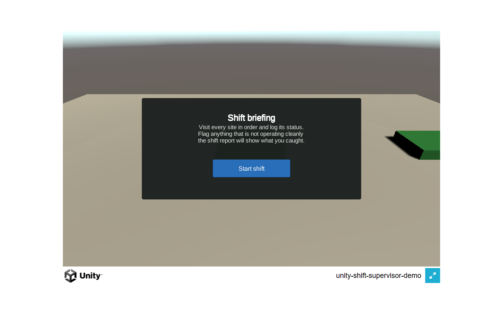
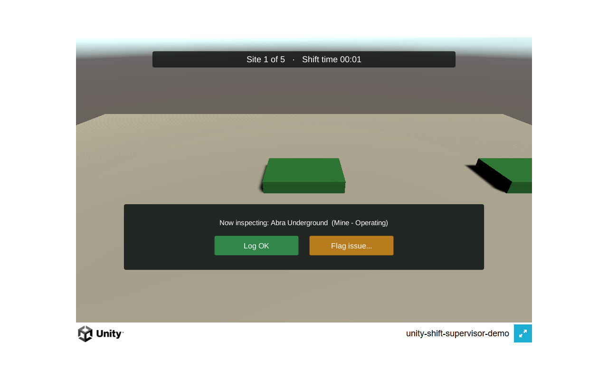
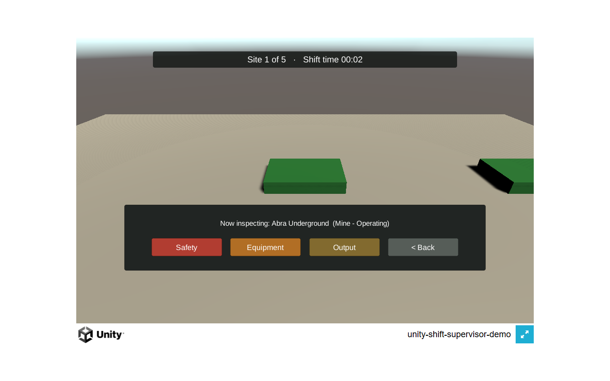
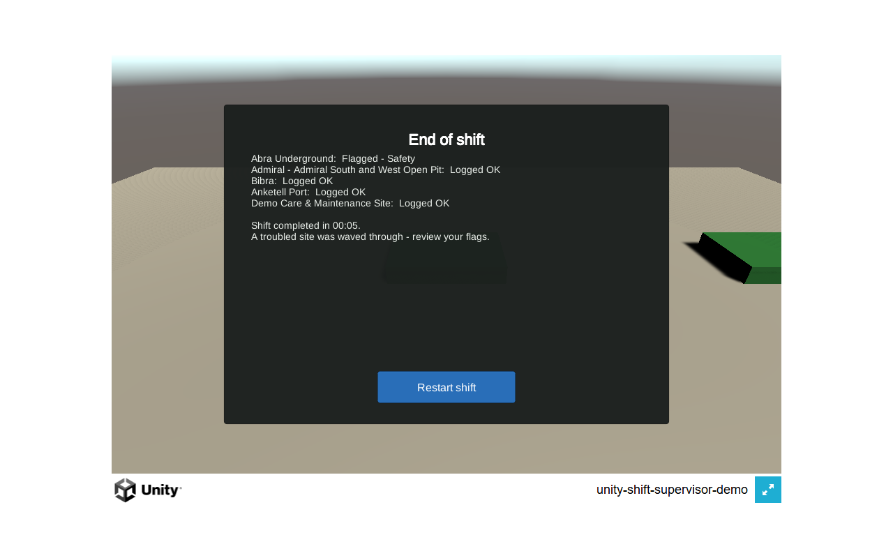

# WA Mining — Shift Supervisor Demo (Unity/C# Prototype)

A small, single-scene Unity prototype exploring what a spatial/3D view of
the same mining-site data (from the [main app](../../README.md)) could look
like, for industrial and XR-adjacent visualization. **This is a learning
and portfolio prototype, not a product build** — see Scope below for
exactly what it is and isn't.

**▶ Live build: [wa-mining-unity.netlify.app](https://wa-mining-unity.netlify.app)** —
the WebGL build, playable in any desktop browser (~32 MB first load;
desktop recommended). Deployed from this folder's `Builds/WebGL` output —
see [Building & deploying](#building--deploying) below. The v2 evolution
of this prototype (requirements discovery, feature spec) lives on the
`feature/unity-shift-supervisor-v2` branch — see
[DISCOVERY.md](DISCOVERY.md) and
[FEATURE_INSPECTION_ROUND.md](FEATURE_INSPECTION_ROUND.md).

### What it looks like

Captured from the deployed WebGL build (increment I2 — the playable
inspection round):

| Shift briefing | Making a call at a site |
|---|---|
|  |  |

| Flagging with a reason | End-of-shift report |
|---|---|
|  |  |

## Why this exists

The rest of this repository is a data pipeline and a FastAPI + React web
app. This folder is a deliberately separate, deliberately small experiment
in a different stack (Unity/C#), to demonstrate picking up that stack and
thinking about the same problem — "what's the status of my sites?" —
spatially instead of as a dashboard. It does not replace, wrap, or depend
on the web app.

## Scope

**What this is:**
- One scene (`ShiftSupervisorDemo.unity`), five clickable 3D markers representing sample mining sites
- **A playable inspection round** (v2 increment I2): briefing → a status call at every site (Log OK / Flag issue with a reason) → an end-of-shift report with your decisions, time, and whether the troubled site was caught → restart. The scenario rules live in a pure-C# core covered by EditMode tests
- Marker color reflects `stage` (Operating / Care and Maintenance / other)
- Click a marker → see its details (name, type, stage, commodity, region) in a UI panel
- Simple mouse-drag orbit + scroll zoom camera
- Site data is a small bundled static JSON snapshot (`Assets/_ShiftSupervisorDemo/Data/sites_sample.json`) — four real site names/attributes from the public MINEDEX dataset already in this repo, plus one clearly-labeled demo entry for the "Care and Maintenance" color

**What this deliberately is not** (per project scope — ask before assuming any of this should be added):
- No backend, API calls, or networking of any kind
- No login/auth, no multiplayer, no database
- No VR/AR headset integration — desktop mouse/keyboard only
- No procedural terrain, advanced shaders, or asset-store content
- Not a live sync with the FastAPI backend's `/api/sites` — the JSON here is a static snapshot, edited by hand

## Structure

```
unity-shift-supervisor-demo/
├── README.md                   # this file
├── DECISIONS.md                # why each non-obvious technical choice was made
├── TROUBLESHOOTING_LOG.md       # real errors hit while building this, with full detail
├── SCENE_SETUP.md               # how the scene was assembled (kept for reference/reproducibility)
├── .gitignore                   # Unity-specific, scoped to this folder only
├── ProjectSettings/              # Unity-generated on first open (see DECISIONS.md)
├── Packages/manifest.json        # Unity-generated + one manual addition (com.unity.ugui, see TROUBLESHOOTING_LOG.md)
└── Assets/
    └── _ShiftSupervisorDemo/     # underscore keeps custom content sorted above package folders in the Editor
        ├── Scripts/
        │   ├── SiteInfo.cs                   # plain data class (+ JSON wrapper)
        │   ├── SiteDatabase.cs                # loads sites_sample.json at startup
        │   ├── SiteMarker.cs                  # clickable marker, colored by stage
        │   ├── ShiftSupervisorUIController.cs # spawns markers, shows the info panel
        │   └── CameraOrbitController.cs       # mouse-drag orbit + scroll zoom
        ├── Data/
        │   └── sites_sample.json
        ├── Scenes/
        │   └── ShiftSupervisorDemo.unity
        └── Prefabs/
            └── SiteMarker.prefab
```

## Running it

1. Unity Hub → **Open** → select this folder.
2. Open `Assets/_ShiftSupervisorDemo/Scenes/ShiftSupervisorDemo.unity`.
3. Press **Play**. Left-click a marker for its details; left-drag to orbit; scroll to zoom.

## Testing

The scenario core (`Scripts/Scenario/`) is plain C# behind an assembly
definition, covered by EditMode tests in `Tests/Editor/` (see
DECISIONS.md, "Scenario core: pure C# behind assembly definitions").
Run them in the Editor via **Window → General → Test Runner → EditMode**,
or headless:

```
"<Unity 6000.x path>\Unity.exe" -batchmode -nographics ^
  -projectPath <this folder> -runTests -testPlatform EditMode ^
  -testResults <absolute path>\editmode-results.xml
```

The inspection round itself is fully playable (increment I2): press
Play (or open the live build) → **Start shift** → make a call at each
site (**Log OK**, or **Flag issue…** with a Safety/Equipment/Output
reason) → the end-of-shift report shows every decision, your time, and
whether the genuinely troubled site was caught → **Restart shift**. The
scenario UI is generated and wired by a committed Editor script
(`Editor/ScenarioUiBuilder.cs`, menu: *Tools → WA Mining Demo → Build
Scenario UI*) — see DECISIONS.md for why it stays in the repo.

## Building & deploying

The WebGL build is produced by a committed Editor script, not remembered
menu clicks (see DECISIONS.md for the editor-version note — builds run on
Unity 6000.5.4f1):

```
"<Unity 6000.x path>\Unity.exe" -batchmode -nographics -quit ^
  -projectPath <this folder> -buildTarget WebGL ^
  -executeMethod WAMining.ShiftSupervisorDemo.EditorTools.WebGLBuildScript.Build
```

Output lands in `Builds/WebGL/` (gitignored — build artifacts stay out of
history). Deploying to the live site is one command against the dedicated
Netlify project (`wa-mining-unity`, kept separate from the web app's site
so the two release cadences never couple):

```
npx netlify-cli deploy --prod --dir Builds/WebGL --site eddecb01-a54a-4d3f-8d0a-f2290602b9b6
```

## Further reading

- **[DECISIONS.md](DECISIONS.md)** — the reasoning behind each non-obvious
  technical choice (render pipeline, UI framework, click detection, data
  approach, and how the scene itself was generated).
- **[TROUBLESHOOTING_LOG.md](TROUBLESHOOTING_LOG.md)** — real errors hit
  building this, with root cause and fix.
- **[SCENE_SETUP.md](SCENE_SETUP.md)** — how the scene in this repo was
  assembled (a one-time Editor script, not manual clicking — see
  DECISIONS.md for why).
